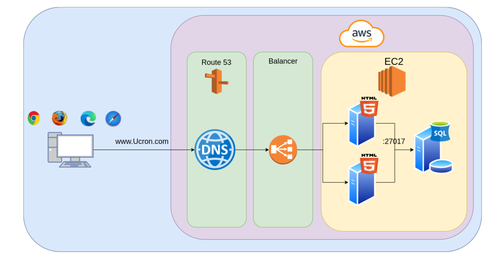
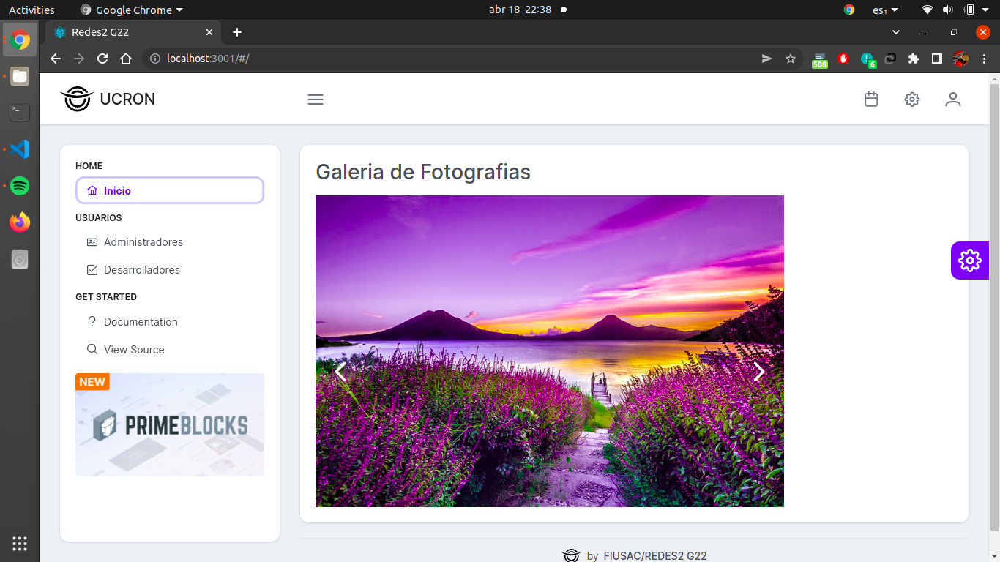
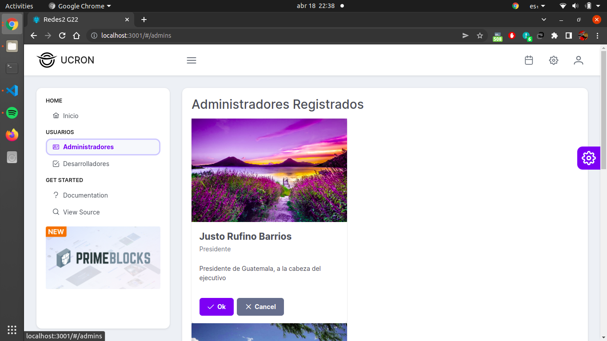

# Proyecto Uno - Manual Tecnico

# Indice
* [Arquitectura](#arquitectura)
* [Web App](#web-app)
* [Base de Datos](#base-de-datos)
* [Proveedor de dominio](#proveedor-de-dominio)
* [Load Balacer](#load-balancer)

## Arquitectura

Tomando en cuenta que se necesita tener una base de datos y una página web
se tiene dos servidores para al momento de exponer puertos y
se pueda restringir quien tenga acceso.
Ucron tiene la siguiente propuesta:



## Web App

La aplicacion web se hizo con la libreria para JavaScript creada por Facebook, ReactJS
que ha tenido mucha influencia y popularidad para la rapida creacion de aplicaciones web
en los recientes años.

Para crear un proyecto de `ReactJS` se debe tener instalado el ambiente de ejecucion `NodeJS` y
el software de gestion de paquetes `npm`.

Creacion de aplicacion:

```
npx create-react-app my-app
cd my-app
npm start
```

Estructura de la aplicaion:
```
my-app/
  README.md
  node_modules/
  package.json
  public/
    index.html
    favicon.ico
  src/
    App.css
    App.js
    App.test.js
    index.css
    index.js
    logo.svg
```

Para facilitar el uso de `ReactJS` se hace uso de [`Primefaces-PrimeReact`](https://www.primefaces.org/primereact/).
Vistas de la aplicacion web:






## Base de Datos

## Proveedor de dominio

## Load Balancer

