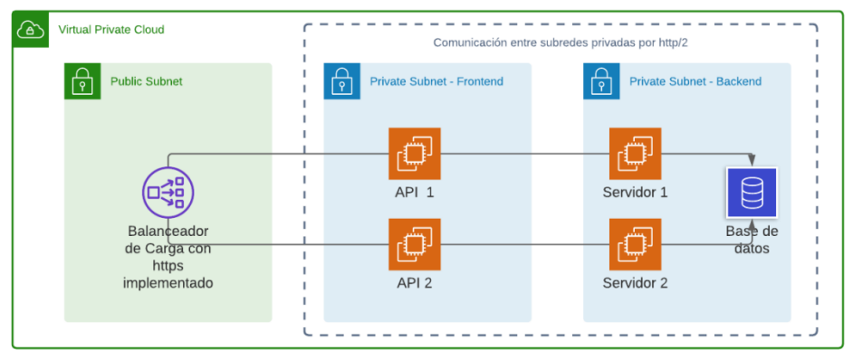

# Proyecto Uno - Manual Tecnico

# Indice
* [Descripcion](#descripcion)
* [Arquitectura](#arquitectura)
* [Web App](#web-app)
* [Base de Datos](#base-de-datos)
* [Proveedor de dominio](#proveedor-de-dominio)
* [Load Balacer](#load-balancer)
* [HTTPS](#https)
* [Seguridad](#seguridad)
* [Subredes Privadas](#subredes-privadas)


## Descripcion

El país de Ucron ahora cuenta con una página para darse a conocer al mundo;
sin embargo, aún no cuentan con la seguridad para prevenir futuros ataques 
cibernéticos y el servicio no cumple con la disponibilidad adecuada para cubrir la
demanda de peticiones realizadas. 
Por ello le solicita nuevamente que realice la configuración necesaria dentro de
la nube para salvaguardar la información con la que cuentan dentro de su
gobierno y restringir el acceso a la misma utilizando los servicios que proporciona
AWS.
Debido a lo anterior se debe mostrar la página web
realizada previamente mediante el uso de EC2 y balanceadores de carga dentro
de subredes creadas dentro de AWS. Debe de instalar un servidor HTTP
(Ejemplo: Apache2) y reemplazar la vista por default por una página de su diseño
personal.


## Arquitectura

Tomando en cuenta que se necesita tener una base de datos y una página web
se tiene dos servidores para al momento de exponer puertos y
se pueda restringir quien tenga acceso.
Ucron tiene la siguiente propuesta:



## Web App

La aplicacion web se hizo con la libreria para JavaScript creada por Facebook, ReactJS
que ha tenido mucha influencia y popularidad para la rapida creacion de aplicaciones web
en los recientes años.

Para crear un proyecto de `ReactJS` se debe tener instalado el ambiente de ejecucion `NodeJS` y
el software de gestion de paquetes `npm`.

Creacion de aplicacion:

```
npx create-react-app my-app
cd my-app
npm start
```

Estructura de la aplicaion:
```
my-app/
  README.md
  node_modules/
  package.json
  public/
    index.html
    favicon.ico
  src/
    App.css
    App.js
    App.test.js
    index.css
    index.js
    logo.svg
```

Para facilitar el uso de `ReactJS` se hace uso de [`Primefaces-PrimeReact`](https://www.primefaces.org/primereact/).
Vistas de la aplicacion web:


## Base de Datos
Para la instalacion de la base de datos se creo una instacion solo con el fin de albergar el servidor MySQL
Y la instalacion se realizó de la siguiente manera

Prerequisitos:

Un sistema corriendo Ubuntu 20.04.4
Una cuenta de usuario con privilegios de
Acceso a la terminal
Conexion de red

Instalar MySQL en Ubuntu 20.04.4

Paso 1 Actualizar los respositorios y obtener la ultima version de los paquetes
sudo apt update
sudo apt upgrade

Paso 2 Instalar MySQL
sudo apt install mysql-server

Paso 3 Verificar que se haya instalado correctamente
mysql --version

Paso 4 Verificar y cambiar la seguridad de MySQL
sudo mysql_secure_installation

Paso 5 Verificar que el servidor de MySQL este corriendo
sudo systemctl status mysql

Ingresar al servidor MySQL
sudo mysql -u root

Por ultimo si se desea tener acceso remoto al servidor modificar el archivo
/etc/mysql/mysql.conf.d/mysqld.cnf
y asignarle la ip corriente del cliente que consumira la BD

Crear las reglas de entrada y salida para permitir que el trafico entre por el
protocolo (TCP/IP) por el puerto 3306 en la instancia que contiene la BD


## Proveedor de dominio
Por ser uno de los 2 recomendados para utilizarse dentro del proyecto y por motivos de costo, se eligió utilizar
https://www.namecheap.com/ como proveedor de dominio 


y se adquirio el dominio redes2grupo22proyecto.xyz 


## Load Balancer


## HTTPS

Para la implementación de https se le recomienda utilizar un certificado gratuito.
Puede elegir entre utilizar un certificado de AWS CM o un certificado de Let´s
Encrypt.

## Seguridad

Se le solicita que proponga y cree las políticas de seguridad para el tráfico a
través de la creación de ACLs y/o Security Groups. Este paso es de vital
importancia para agregar capas extra de seguridad dentro de la VPC. Debe
documentar y justificar las reglas creadas en la documentación (documentar
reglas de las ACL utilizadas y puertos expuestos de las instancias EC2 o
LoadBalancer)

## Nombres de Dominio

También se le solicita crear nombres de dominio, que permitan acceder a la API.
Se le socilita un nombre de dominio principal y un nombre de dominio secundario
que funcione como un alias para el dominio principal.

* grupo#-api.tk (principal)
* grupo#-api.ml (secundario)

La página debe poder ser accedida desde cualquiera de los dos dominios
definidos. Debe agregar a la documentación la información relacionada a los
registros utilizados para llevar a cabo lo solicitado.

## Subredes Privadas

Debido a que las instancias se encuentran en una subred privada, estas no
poseen acceso a internet. Esto imposibilita la capacidad de actualizar o instalar
paquete en las instancias. Es por ello que se le solicita que agregue un NAT
Gateway, y realice las configuraciones necesarias para garantizar el acceso a
internet de manera segura para las instancias
